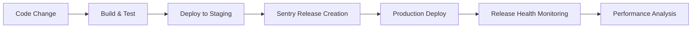

# ADR-003: Monitoring and Error Tracking Solution - Sentry

**Status**: Accepted  
**Date**: January 2025  
**Deciders**: Development Team, Operations Team  

## Context

MonEpice&Riz requires comprehensive monitoring, error tracking, and performance monitoring to ensure reliable e-commerce operations. The system must provide early warning of issues, detailed error context for debugging, and performance insights to optimize user experience in the Côte d'Ivoire market.

## Decision

We chose **Sentry** as our primary monitoring, error tracking, and performance monitoring solution.

## Rationale

### Sentry Advantages

1. **Comprehensive Error Tracking**
   - Real-time error capture and alerting
   - Detailed stack traces with source map support
   - Error grouping and deduplication
   - Custom error contexts and tags
   - Breadcrumb tracking for debugging

2. **Performance Monitoring**
   - Transaction tracing across frontend and backend
   - Web Vitals monitoring (LCP, FID, CLS, TTFB)
   - Database query performance tracking
   - API endpoint monitoring
   - Custom performance metrics

3. **Next.js Integration**
   - Official Next.js SDK with excellent support
   - Automatic page route transaction tracking
   - API route monitoring
   - Build-time source map upload
   - Edge runtime support

4. **User Experience Features**
   - Session replay for issue reproduction
   - User feedback integration
   - Release health tracking
   - Deploy notification and regression detection
   - User-centric error attribution

5. **Developer Experience**
   - Intuitive dashboard and issue management
   - Advanced search and filtering capabilities
   - Integration with development workflow (GitHub, Slack)
   - Custom alert rules and notification channels
   - Comprehensive SDK documentation

6. **Business Intelligence**
   - Release impact analysis
   - Performance regression detection
   - User experience metrics
   - Business KPI correlation with technical metrics
   - Custom dashboards and reporting

### Alternative Analysis

**LogRocket**:
- Pros: Excellent session replay, detailed frontend analytics
- Cons: Higher cost, primarily frontend-focused, limited backend monitoring

**DataDog**:
- Pros: Comprehensive infrastructure monitoring, excellent APM
- Cons: Complex setup, higher cost, overkill for current needs

**New Relic**:
- Pros: Strong APM capabilities, good ecosystem integration
- Cons: Expensive for small teams, complex configuration

**Rollbar**:
- Pros: Good error tracking, competitive pricing
- Cons: Limited performance monitoring, fewer integrations

**Console.log + Manual Monitoring**:
- Pros: No additional cost, full control
- Cons: No real-time alerts, manual effort, poor visibility

## Implementation Strategy

### Phase 1: Core Setup

1. **Error Tracking Implementation**
   ```typescript
   // Client-side configuration
   - Browser error capture
   - React error boundaries
   - Custom error contexts
   - Sensitive data filtering
   ```

2. **Performance Monitoring**
   ```typescript
   // Performance tracking
   - Page load monitoring
   - API response time tracking
   - Database query monitoring
   - Custom business metrics
   ```

3. **Release Management**
   ```typescript
   // Deployment integration
   - Source map upload automation
   - Release creation and tracking
   - Deploy notifications
   - Regression detection
   ```

### Phase 2: Advanced Features

1. **User Experience Monitoring**
   - Session replay for critical user flows
   - User feedback integration on error pages
   - Custom user journey tracking
   - Performance impact on business metrics

2. **Business Intelligence**
   - Payment processing error correlation
   - Order completion rate monitoring
   - Custom business event tracking
   - Revenue impact of technical issues

3. **Operational Excellence**
   - SLA monitoring and alerting
   - Capacity planning insights
   - Performance optimization recommendations
   - Incident response automation

## Configuration Details

### Environment-Specific Setup

**Development Environment**:
```typescript
{
  environment: 'development',
  debug: true,
  sampleRate: 1.0, // 100% error capture
  tracesSampleRate: 1.0, // 100% performance tracking
  replaysSessionSampleRate: 1.0 // 100% session replay
}
```

**Staging Environment**:
```typescript
{
  environment: 'staging',
  debug: false,
  sampleRate: 1.0, // 100% error capture
  tracesSampleRate: 0.5, // 50% performance tracking
  replaysSessionSampleRate: 0.1 // 10% session replay
}
```

**Production Environment**:
```typescript
{
  environment: 'production',
  debug: false,
  sampleRate: 1.0, // 100% error capture
  tracesSampleRate: 0.1, // 10% performance tracking
  replaysSessionSampleRate: 0.01 // 1% session replay
}
```

### Alert Configuration

**Critical Alerts** (Immediate Response):
- Payment processing failures >5% in 5 minutes
- Authentication system errors
- Database connection failures
- API gateway errors >50% in 2 minutes

**High Priority Alerts** (Within 1 hour):
- Error rate >10% in 15 minutes
- Performance degradation >50% slowdown
- New error types affecting >10 users
- Third-party service integration failures

**Medium Priority Alerts** (Within 4 hours):
- Unusual error patterns
- Performance regression >20%
- Feature usage anomalies
- Non-critical service warnings

### Data Privacy and Security

1. **Sensitive Data Filtering**
   ```typescript
   // Automatically filtered fields
   - passwords, tokens, api_keys
   - credit card numbers
   - phone numbers (partially masked)
   - email addresses (domain preserved)
   - personal identification data
   ```

2. **GDPR Compliance**
   - Data retention: 90 days for errors, 30 days for performance
   - User data minimization
   - Right to be forgotten implementation
   - Data processing consent management

3. **Geographic Considerations**
   - IP address anonymization for Côte d'Ivoire users
   - French language error messages
   - Local timezone configuration
   - Regional compliance requirements

## Integration Points

### Development Workflow


### Business Process Integration
- **Order Processing**: Monitor payment flow completion rates
- **Inventory Management**: Track stock synchronization errors
- **Customer Support**: Automatic error context for support tickets
- **Marketing Analytics**: Correlate technical issues with conversion rates

### Third-Party Service Monitoring
- **Appwrite**: Database query performance and error rates
- **CinetPay**: Payment processing success rates and latencies
- **SMS/Email Services**: Notification delivery monitoring
- **CDN/Storage**: Asset delivery performance tracking

## Custom Metrics and Events

### Business Metrics
```typescript
// E-commerce specific tracking
Sentry.addBreadcrumb({
  category: 'business',
  message: 'Order placed',
  data: {
    orderId: 'ORDER_123',
    amount: 15000,
    paymentMethod: 'orange_money',
    store: 'COCODY'
  }
});
```

### Performance Metrics
```typescript
// Custom performance tracking
const transaction = Sentry.startTransaction({
  name: 'checkout_flow',
  op: 'user_interaction'
});

// Track critical user flows
- Product search and filtering
- Add to cart operations
- Checkout process completion
- Payment processing time
- Order confirmation delivery
```

### Error Contexts
```typescript
// Enhanced error context
Sentry.setContext('business', {
  store: 'COCODY',
  userType: 'premium_customer',
  orderValue: 25000,
  paymentMethod: 'mobile_money'
});
```

## Consequences

### Positive

1. **Improved Reliability**
   - Proactive issue detection before customer impact
   - Faster mean time to resolution (MTTR)
   - Reduced system downtime through early warnings
   - Better understanding of system behavior patterns

2. **Enhanced Developer Productivity**
   - Detailed error contexts reduce debugging time
   - Performance insights guide optimization efforts
   - Release impact visibility prevents regressions
   - Automated error grouping reduces noise

3. **Better User Experience**
   - Faster issue resolution improves customer satisfaction
   - Performance monitoring ensures optimal user experience
   - Session replay helps reproduce and fix user issues
   - Proactive monitoring prevents widespread outages

4. **Business Intelligence**
   - Technical metrics correlation with business KPIs
   - Performance impact analysis on conversion rates
   - Error cost analysis and ROI of fixes
   - Data-driven capacity planning decisions

### Negative

1. **Additional Complexity**
   - SDK integration and configuration overhead
   - Performance impact of monitoring instrumentation
   - Alert fatigue if not properly configured
   - Data privacy compliance requirements

2. **Cost Considerations**
   - Monthly subscription costs based on event volume
   - Potential data overage charges
   - Session replay storage costs
   - Custom integration development time

3. **Learning Curve**
   - Team training on Sentry dashboard and features
   - Alert management and escalation procedures
   - Performance analysis and optimization workflows
   - Custom instrumentation best practices

### Risk Mitigation

1. **Performance Impact**
   - Careful sampling rate configuration for production
   - Async error reporting to prevent blocking operations
   - Regular performance monitoring of monitoring overhead
   - Graceful degradation if Sentry is unavailable

2. **Cost Management**
   - Event volume monitoring and optimization
   - Intelligent sampling strategies
   - Regular plan review and adjustment
   - Custom rate limiting for high-volume events

3. **Alert Management**
   - Gradual alert threshold tuning
   - Escalation procedures to prevent alert fatigue
   - Regular review of alert effectiveness
   - Team rotation for alert response duties

## Success Metrics

### Technical Metrics
- **Mean Time to Detection (MTTD)**: <5 minutes for critical issues
- **Mean Time to Resolution (MTTR)**: <30 minutes for critical issues
- **Error Rate**: <1% application error rate in production
- **Performance**: <3 second page load times for 95th percentile

### Business Metrics
- **System Uptime**: >99.9% availability during business hours
- **Customer Impact**: <0.1% of orders affected by technical issues
- **Development Velocity**: 20% faster issue resolution
- **Customer Satisfaction**: Maintain >90% satisfaction despite technical issues

### Operational Metrics
- **Alert Accuracy**: >80% of alerts result in actionable items
- **False Positive Rate**: <20% false positive alert rate
- **Coverage**: 100% of critical user flows monitored
- **Response Time**: <5 minutes average alert response time

## Monitoring and Maintenance

### Daily Operations
- Alert triage and response
- Error trend analysis
- Performance regression detection
- Release health monitoring

### Weekly Reviews
- Alert threshold optimization
- Performance trend analysis
- Error pattern investigation
- Team alert response effectiveness

### Monthly Analysis
- Cost optimization review
- Feature usage analytics
- Business impact correlation
- Monitoring coverage assessment

### Quarterly Planning
- Capacity planning based on trends
- Monitoring strategy evolution
- Tool evaluation and optimization
- Team training and skill development

## Future Enhancements

### Phase 3: Advanced Analytics
- Machine learning-based anomaly detection
- Predictive performance analysis
- Customer journey impact correlation
- Business intelligence dashboard integration

### Phase 4: Automation
- Automated issue classification and routing
- Self-healing system responses
- Intelligent alert suppression
- Capacity auto-scaling triggers

## References

- [Sentry Next.js Documentation](https://docs.sentry.io/platforms/javascript/guides/nextjs/)
- [Sentry Performance Monitoring Best Practices](https://docs.sentry.io/product/performance/getting-started/)
- [E-commerce Monitoring Strategies](https://example.com/ecommerce-monitoring)
- [GDPR Compliance for Monitoring Tools](https://example.com/gdpr-monitoring)
- [SLA Definition and Monitoring](https://example.com/sla-monitoring)

---

**Last Updated**: January 2025  
**Next Review**: Q2 2025 or when reaching 10,000+ monthly active users