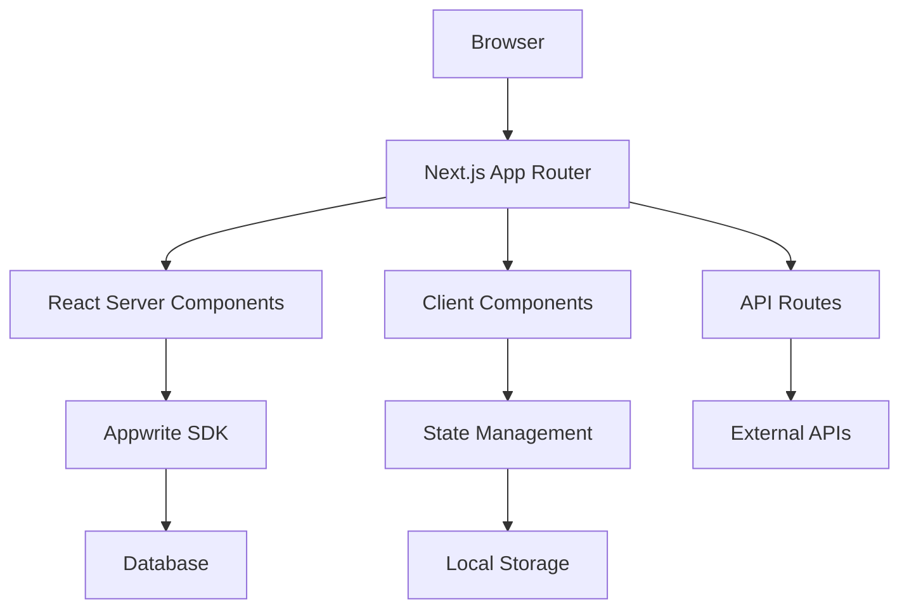

# ADR-004: Frontend Architecture - Next.js 15 with App Router and TypeScript

**Status**: Accepted  
**Date**: January 2025  
**Deciders**: Development Team, Technical Lead  

## Context

MonEpice&Riz requires a modern, performant, and SEO-friendly frontend architecture that can deliver excellent user experience in the Côte d'Ivoire market, where internet connectivity can be variable and mobile usage is predominant.

## Decision

We chose **Next.js 15.4.4 with App Router and TypeScript** as our frontend architecture.

## Rationale

### Next.js Advantages

1. **Performance Optimization**
   - **Server-Side Rendering (SSR)**: Fast initial page loads crucial for mobile users
   - **Static Site Generation (SSG)**: Pre-built pages for product catalogs
   - **Incremental Static Regeneration (ISR)**: Dynamic content with static performance
   - **Automatic Code Splitting**: Reduced bundle sizes for faster loading
   - **Image Optimization**: Built-in image optimization for product photos
   - **Edge Computing**: Faster response times through global edge network

2. **SEO and Marketing**
   - **Server-Side Rendering**: Excellent SEO for product discovery
   - **Meta Tag Management**: Dynamic meta tags for social media sharing
   - **Structured Data**: Rich snippets for search engines
   - **Sitemap Generation**: Automatic sitemap creation for search engines
   - **Core Web Vitals**: Built-in optimization for Google ranking factors

3. **Developer Experience**
   - **Hot Module Replacement**: Fast development iteration
   - **Built-in TypeScript Support**: Type safety without configuration
   - **File-Based Routing**: Intuitive routing system
   - **API Routes**: Full-stack development in single framework
   - **Built-in CSS Support**: Multiple styling options

4. **App Router Benefits (Next.js 13+)**
   - **React Server Components**: Better performance and reduced bundle size
   - **Streaming UI**: Progressive page loading for better UX
   - **Nested Layouts**: Reusable layout components
   - **Route Groups**: Better code organization
   - **Parallel Routes**: Complex UI patterns support
   - **Intercepting Routes**: Modal and overlay handling

### TypeScript Advantages

1. **Type Safety**
   - **Compile-Time Error Detection**: Catch errors before runtime
   - **API Contract Enforcement**: Type-safe integration with Appwrite
   - **Enhanced IDE Support**: Better autocomplete and refactoring
   - **Self-Documenting Code**: Types serve as inline documentation
   - **Refactoring Confidence**: Safe large-scale code changes

2. **Team Productivity**
   - **Reduced Debugging Time**: Fewer runtime type errors
   - **Better Onboarding**: Types help new developers understand code
   - **API Integration**: Type-safe external service integration
   - **Maintainability**: Easier long-term code maintenance

3. **E-commerce Specific Benefits**
   - **Product Data Modeling**: Type-safe product catalogs
   - **Payment Processing**: Secure type-safe payment flows
   - **User Management**: Typed user interfaces and permissions
   - **Order Management**: Complex order state management

### Mobile-First Considerations

1. **Performance for Mobile Networks**
   - **Small Bundle Sizes**: Critical for slower 3G/4G networks
   - **Progressive Loading**: Graceful degradation on poor connections
   - **Offline Capabilities**: Service worker integration
   - **Caching Strategies**: Aggressive caching for repeat visits

2. **User Experience**
   - **Touch-Friendly Interface**: Mobile-optimized interactions
   - **Progressive Web App (PWA)**: App-like experience
   - **Responsive Design**: Single codebase for all devices
   - **Accessibility**: WCAG compliance for diverse user needs

## Implementation Strategy

### Architecture Pattern



### Project Structure

```
monepiceriz-mvp/
├── app/                          # App Router (Next.js 13+)
│   ├── (marketing)/             # Route groups
│   │   ├── layout.tsx
│   │   └── page.tsx
│   ├── (store)/
│   │   ├── products/
│   │   ├── checkout/
│   │   └── account/
│   ├── api/                     # API routes
│   │   ├── webhooks/
│   │   └── auth/
│   ├── globals.css
│   ├── layout.tsx               # Root layout
│   └── page.tsx                 # Home page
├── components/                   # Reusable UI components
│   ├── ui/                      # Design system components
│   ├── features/                # Business logic components
│   └── layout/                  # Layout components
├── lib/                         # Utilities and configurations
│   ├── appwrite.ts
│   ├── config/
│   ├── services/
│   ├── types/
│   └── utils/
├── providers/                   # React Context providers
├── public/                      # Static assets
├── styles/                      # Global styles
└── types/                       # TypeScript type definitions
```

### State Management Strategy

1. **React Server Components** (Primary)
   - Server-side data fetching
   - Reduced JavaScript bundle
   - Direct database access

2. **React Context** (Authentication, Global State)
   - User authentication state
   - Shopping cart state
   - Application preferences

3. **URL State** (Filters, Search)
   - Product filtering
   - Search parameters
   - Pagination state

4. **Local Storage** (Persistence)
   - Shopping cart persistence
   - User preferences
   - Offline data caching

### Performance Optimization

1. **Code Splitting**
   ```typescript
   // Route-based splitting (automatic)
   // Component-based splitting (manual)
   const ProductModal = lazy(() => import('./ProductModal'));
   ```

2. **Image Optimization**
   ```typescript
   import Image from 'next/image';
   
   <Image
     src="/products/escargots.jpg"
     alt="Escargots de San Pedro"
     width={400}
     height={300}
     priority={false}
     placeholder="blur"
   />
   ```

3. **Caching Strategy**
   ```typescript
   // Static generation for product pages
   export async function generateStaticParams() {
     const products = await getProducts();
     return products.map(product => ({ slug: product.slug }));
   }
   
   // Incremental regeneration
   export const revalidate = 3600; // 1 hour
   ```

### SEO Implementation

1. **Dynamic Metadata**
   ```typescript
   export async function generateMetadata({ params }): Promise<Metadata> {
     const product = await getProduct(params.slug);
     
     return {
       title: `${product.name} - MonEpice&Riz`,
       description: product.description,
       openGraph: {
         title: product.name,
         description: product.description,
         images: [product.imageUrl],
       },
     };
   }
   ```

2. **Structured Data**
   ```typescript
   const productJsonLd = {
     '@context': 'https://schema.org',
     '@type': 'Product',
     name: product.name,
     description: product.description,
     image: product.imageUrl,
     offers: {
       '@type': 'Offer',
       price: product.price,
       priceCurrency: 'XOF',
       availability: 'https://schema.org/InStock',
     },
   };
   ```

## Consequences

### Positive

1. **Performance Benefits**
   - **Fast Loading**: SSR and SSG provide excellent initial load times
   - **SEO Optimization**: Server-rendered content improves search rankings
   - **Mobile Performance**: Optimized for mobile networks in Côte d'Ivoire
   - **Bundle Optimization**: Automatic code splitting reduces bundle sizes

2. **Developer Experience**
   - **Type Safety**: TypeScript prevents runtime errors and improves code quality
   - **Hot Reloading**: Fast development iteration and debugging
   - **Integrated Tooling**: Built-in optimization and development tools
   - **Modern React**: Latest React features and patterns

3. **Business Advantages**
   - **SEO Benefits**: Better search engine visibility for product discovery
   - **Conversion Optimization**: Fast loading improves conversion rates
   - **Mobile-First**: Optimized for primary user device (mobile)
   - **Scalability**: Architecture supports business growth

4. **Maintenance Benefits**
   - **Type Safety**: Reduced bugs and easier refactoring
   - **Code Organization**: Clear project structure and patterns
   - **Documentation**: Types serve as living documentation
   - **Testing**: Better testability with TypeScript

### Negative

1. **Learning Curve**
   - **App Router Complexity**: New paradigm for developers familiar with Pages Router
   - **TypeScript Overhead**: Initial setup and type definition effort
   - **React Server Components**: New mental model for data fetching
   - **Build Complexity**: More complex build and deployment process

2. **Development Overhead**
   - **Type Definitions**: Time investment in creating comprehensive types
   - **Build Time**: TypeScript compilation adds to build time
   - **Bundle Size**: Framework overhead compared to plain React
   - **Configuration**: More complex configuration than simple React apps

3. **Deployment Considerations**
   - **Server Requirements**: Need for Node.js server for SSR
   - **Edge Cases**: Potential hydration mismatches
   - **Caching Complexity**: Complex caching strategies for dynamic content
   - **Monitoring**: More complex error tracking across server/client

### Risk Mitigation

1. **Performance Monitoring**
   - Comprehensive Core Web Vitals monitoring
   - Bundle size analysis and optimization
   - Server response time monitoring
   - User experience metrics tracking

2. **Development Process**
   - Comprehensive TypeScript training for team
   - Code review processes for type safety
   - Testing strategies for Server Components
   - Documentation for complex patterns

3. **Deployment Strategy**
   - Staged rollout for major changes
   - Fallback strategies for server issues
   - CDN optimization for static assets
   - Performance budgets and monitoring

## Alternative Architectures Considered

### React SPA + Client-Side Routing
- **Pros**: Simpler deployment, familiar patterns
- **Cons**: Poor SEO, slower initial loads, not suitable for e-commerce
- **Verdict**: Rejected due to SEO requirements

### Vue.js + Nuxt
- **Pros**: Good performance, simpler learning curve
- **Cons**: Smaller ecosystem, team unfamiliarity, fewer TypeScript benefits
- **Verdict**: Rejected due to team expertise and ecosystem

### Svelte + SvelteKit
- **Pros**: Excellent performance, smaller bundle sizes
- **Cons**: Smaller ecosystem, limited team experience, fewer resources
- **Verdict**: Rejected due to ecosystem maturity

### Server-Side Only (Traditional MPA)
- **Pros**: Simple deployment, excellent SEO
- **Cons**: Poor user experience, no modern interactions
- **Verdict**: Rejected due to UX requirements

## Success Metrics

### Performance Metrics
- **Largest Contentful Paint (LCP)**: <2.5 seconds
- **First Input Delay (FID)**: <100 milliseconds
- **Cumulative Layout Shift (CLS)**: <0.1
- **Time to First Byte (TTFB)**: <800 milliseconds

### SEO Metrics
- **Search Engine Indexing**: 100% of product pages indexed
- **Core Web Vitals**: Pass all Core Web Vitals assessments
- **Mobile-Friendly Test**: 100% mobile-friendly pages
- **Page Speed Score**: >90 for mobile and desktop

### Development Metrics
- **Build Time**: <5 minutes for production builds
- **Type Coverage**: >90% TypeScript coverage
- **Bundle Size**: <250KB gzipped for critical path
- **Development Server Start**: <10 seconds

### Business Metrics
- **Conversion Rate**: 15% improvement over baseline
- **Bounce Rate**: <40% for product pages
- **Page Load Time**: Direct correlation with conversion
- **Mobile Traffic**: Optimized for >80% mobile users

## Implementation Phases

### Phase 1: Core Architecture (4 weeks)
- Next.js setup with App Router
- TypeScript configuration
- Basic routing and layouts
- Appwrite integration

### Phase 2: E-commerce Features (6 weeks)
- Product catalog with SSG
- Shopping cart functionality
- User authentication
- Search and filtering

### Phase 3: Performance Optimization (4 weeks)
- Image optimization
- Caching strategies
- Bundle analysis and optimization
- Performance monitoring

### Phase 4: SEO and Marketing (3 weeks)
- Meta tags and structured data
- Sitemap generation
- Social media integration
- Analytics implementation

## Maintenance and Evolution

### Regular Tasks
- **Weekly**: Bundle size monitoring and Core Web Vitals review
- **Monthly**: Dependency updates and security patches
- **Quarterly**: Performance audit and optimization
- **Yearly**: Major version upgrades and architecture review

### Evolution Path
- **Short-term**: PWA features and offline capabilities
- **Medium-term**: Edge computing optimization
- **Long-term**: Micro-frontend architecture if needed

## References

- [Next.js 15 Documentation](https://nextjs.org/docs)
- [App Router Migration Guide](https://nextjs.org/docs/app/building-your-application/upgrading/app-router-migration)
- [React Server Components](https://react.dev/blog/2023/03/22/react-labs-what-we-have-been-working-on-march-2023#react-server-components)
- [TypeScript Handbook](https://www.typescriptlang.org/docs/)
- [Core Web Vitals](https://web.dev/vitals/)
- [E-commerce Performance Best Practices](https://web.dev/ecommerce-performance/)

---

**Last Updated**: January 2025  
**Next Review**: Q3 2025 or upon Next.js major version release