# ADR-005: Environment and Deployment Strategy - Three-Environment Setup

**Status**: Accepted  
**Date**: January 2025  
**Deciders**: Development Team, DevOps Team, Business Team  

## Context

MonEpice&Riz requires a robust deployment strategy that ensures reliable e-commerce operations while enabling safe development and testing cycles. The system must handle financial transactions, customer data, and inventory management with zero tolerance for production issues.

## Decision

We chose a **three-environment deployment strategy** with Development, Staging, and Production environments, each with isolated services and data.

## Rationale

### Three-Environment Benefits

1. **Risk Mitigation**
   - **Isolated Testing**: Changes tested in staging before production
   - **Data Protection**: Production data never exposed to development
   - **Rollback Safety**: Multiple checkpoints before customer impact
   - **Service Isolation**: Each environment has separate third-party services

2. **Development Workflow**
   - **Feature Development**: Safe development environment for experimentation
   - **Integration Testing**: Staging environment for end-to-end testing
   - **Quality Assurance**: Production-like testing before release
   - **Performance Testing**: Load testing without production impact

3. **Business Continuity**
   - **Zero-Downtime Deployments**: Blue-green deployment capability
   - **Hotfix Capability**: Rapid production fixes through staging validation
   - **Disaster Recovery**: Multiple environment copies for backup
   - **Customer Protection**: Multiple validation layers prevent issues

4. **Compliance and Security**
   - **Data Segregation**: Separate databases and storage per environment
   - **Access Control**: Role-based environment access
   - **Audit Trails**: Complete deployment and change tracking
   - **Security Testing**: Isolated security validation

## Environment Architecture

### Development Environment

**Purpose**: Feature development and initial testing

**Configuration**:
```yaml
Domain: localhost:3000
Database: monepiceriz-dev (Appwrite)
Payments: CinetPay Sandbox
Monitoring: Sentry Development Project
Storage: Development bucket
```

**Characteristics**:
- Full debugging enabled
- Hot module replacement
- Verbose logging
- 100% error capture
- Synthetic test data
- No rate limiting

**Access**:
- All developers
- Automated testing
- Integration tests
- Local development

### Staging Environment

**Purpose**: Production-like testing and QA validation

**Configuration**:
```yaml
Domain: staging.monepiceriz.ci
Database: monepiceriz-staging (Appwrite)
Payments: CinetPay Sandbox (production-like config)
Monitoring: Sentry Staging Project
Storage: Staging bucket with CDN
```

**Characteristics**:
- Production-like configuration
- Real payment flow testing
- Performance monitoring
- Load testing capability
- Automated deployment
- Manual QA validation

**Access**:
- QA team
- Product owners
- Selected stakeholders
- Automated testing
- Performance testing

### Production Environment

**Purpose**: Live customer-facing e-commerce platform

**Configuration**:
```yaml
Domain: monepiceriz.ci
Database: monepiceriz-prod (Appwrite)
Payments: CinetPay Production
Monitoring: Sentry Production Project
Storage: Production bucket with global CDN
```

**Characteristics**:
- Maximum performance optimization
- Comprehensive monitoring
- Automated alerts
- Minimal logging overhead
- Rate limiting enabled
- Security hardening

**Access**:
- Operations team only
- Automated deployment
- Emergency access procedures
- Audit logging enabled

## Deployment Pipeline

### Continuous Integration/Continuous Deployment (CI/CD)

```mermaid
graph LR
    A[Developer Push] --> B[GitHub Actions]
    B --> C[Lint & Test]
    C --> D[Build Application]
    D --> E[Deploy to Development]
    E --> F[Integration Tests]
    F --> G[Deploy to Staging]
    G --> H[QA Validation]
    H --> I[Deploy to Production]
    I --> J[Health Checks]
    J --> K[Monitoring & Alerts]
```



### Deployment Strategies by Environment

**Development Deployment**:
- **Trigger**: Every push to feature branches
- **Strategy**: Direct deployment
- **Validation**: Automated tests only
- **Rollback**: Not required (development only)

**Staging Deployment**:
- **Trigger**: Merge to main branch
- **Strategy**: Blue-green deployment
- **Validation**: Automated tests + manual QA
- **Rollback**: Automatic on test failure

**Production Deployment**:
- **Trigger**: Manual approval after staging validation
- **Strategy**: Blue-green with canary testing
- **Validation**: Comprehensive health checks
- **Rollback**: Automatic on health check failure

### Database Migration Strategy

1. **Development Phase**
   ```bash
   # Schema changes tested locally
   npm run db:migrate:dev
   npm run db:seed:dev
   ```

2. **Staging Validation**
   ```bash
   # Migration tested with production-like data
   npm run db:migrate:staging
   npm run db:verify:staging
   ```

3. **Production Deployment**
   ```bash
   # Zero-downtime migration with backup
   npm run db:backup:prod
   npm run db:migrate:prod
   npm run db:verify:prod
   ```

## Service Configuration

### Appwrite Configuration

**Development**:
```typescript
{
  projectId: 'monepiceriz-dev',
  endpoint: 'https://cloud.appwrite.io/v1',
  databases: ['dev-database'],
  storage: ['dev-images', 'dev-documents'],
  functions: ['dev-functions']
}
```

**Staging**:
```typescript
{
  projectId: 'monepiceriz-staging',
  endpoint: 'https://cloud.appwrite.io/v1',
  databases: ['staging-database'],
  storage: ['staging-images', 'staging-documents'],
  functions: ['staging-functions']
}
```

**Production**:
```typescript
{
  projectId: 'monepiceriz-prod',
  endpoint: 'https://cloud.appwrite.io/v1',
  databases: ['prod-database'],
  storage: ['prod-images', 'prod-documents'],
  functions: ['prod-functions']
}
```

### CinetPay Configuration

**Development & Staging**:
```typescript
{
  environment: 'sandbox',
  apiKey: 'sandbox-api-key',
  siteId: 'sandbox-site-id',
  webhookUrl: 'https://staging.monepiceriz.ci/api/webhooks/cinetpay'
}
```

**Production**:
```typescript
{
  environment: 'production',
  apiKey: 'production-api-key',
  siteId: 'production-site-id',
  webhookUrl: 'https://monepiceriz.ci/api/webhooks/cinetpay'
}
```

### Sentry Configuration

**Environment-Specific Settings**:
```typescript
// Development
{
  dsn: 'dev-dsn',
  environment: 'development',
  sampleRate: 1.0,
  debug: true
}

// Staging
{
  dsn: 'staging-dsn',
  environment: 'staging',
  sampleRate: 0.5,
  debug: false
}

// Production
{
  dsn: 'prod-dsn',
  environment: 'production',
  sampleRate: 0.1,
  debug: false
}
```

## Security and Access Control

### Environment Access Matrix

| Role | Development | Staging | Production |
|------|-------------|---------|------------|
| Developer | Full Access | Read Only | No Access |
| QA Engineer | Read Only | Full Access | No Access |
| DevOps | Full Access | Full Access | Deploy Only |
| Operations | No Access | Read Only | Full Access |
| Business Owner | No Access | View Only | View Only |

### Security Measures

1. **Network Security**
   ```yaml
   Development:
     - VPN not required
     - Open to developers
     - Basic authentication
   
   Staging:
     - VPN required for admin access
     - IP whitelisting for external access
     - Enhanced authentication
   
   Production:
     - VPN required
     - Multi-factor authentication
     - IP whitelisting
     - Audit logging
   ```

2. **Data Protection**
   ```yaml
   Development:
     - Synthetic data only
     - No customer information
     - Mock payment data
   
   Staging:
     - Anonymized production data
     - Masked customer information
     - Sandbox payment processing
   
   Production:
     - Encrypted customer data
     - PCI compliance
     - Real payment processing
   ```

3. **API Security**
   ```yaml
   Development:
     - Basic rate limiting
     - Development API keys
     - Verbose error messages
   
   Staging:
     - Production-like rate limiting
     - Staging API keys
     - Limited error details
   
   Production:
     - Strict rate limiting
     - Production API keys
     - Minimal error exposure
   ```

## Monitoring and Observability

### Environment-Specific Monitoring

**Development**:
- Basic error tracking
- Performance profiling
- Debug logging
- Local metrics

**Staging**:
- Full error tracking
- Performance monitoring
- Load testing metrics
- QA validation tracking

**Production**:
- Real-time monitoring
- Business metrics
- SLA monitoring
- Customer impact tracking

### Alert Configuration

**Development Alerts**:
- Build failures
- Test failures
- Critical errors only

**Staging Alerts**:
- Deployment failures
- Performance regressions
- Integration test failures
- QA blockers

**Production Alerts**:
- Service downtime
- Payment failures
- High error rates
- Performance degradation
- Security incidents

## Disaster Recovery

### Backup Strategy

1. **Database Backups**
   ```yaml
   Development: Daily snapshots (7 days retention)
   Staging: Daily snapshots (30 days retention)
   Production: 
     - Continuous replication
     - Daily snapshots (90 days retention)
     - Weekly full backups (1 year retention)
   ```

2. **File Storage Backups**
   ```yaml
   Development: Weekly backups
   Staging: Daily backups (30 days retention)
   Production: 
     - Real-time replication
     - Daily snapshots (90 days retention)
   ```

### Recovery Procedures

**Development Recovery**:
- Restore from latest snapshot
- Acceptable downtime: 4 hours
- Self-service recovery

**Staging Recovery**:
- Restore from daily backup
- Acceptable downtime: 2 hours
- DevOps team responsibility

**Production Recovery**:
- Multi-region failover: <5 minutes
- Database restore: <30 minutes
- Full system restore: <2 hours
- Operations team responsibility

## Cost Optimization

### Resource Allocation

**Development**:
- Shared resources
- Lower-tier instances
- Minimal redundancy
- Cost: ~10% of total

**Staging**:
- Dedicated resources
- Production-like sizing
- Limited redundancy
- Cost: ~20% of total

**Production**:
- High-availability setup
- Auto-scaling enabled
- Full redundancy
- Cost: ~70% of total

### Cost Management

1. **Development Cost Controls**
   - Auto-shutdown after hours
   - Resource sharing
   - Minimal third-party services

2. **Staging Optimization**
   - On-demand scaling
   - Limited retention periods
   - Shared non-critical services

3. **Production Efficiency**
   - Right-sizing based on metrics
   - Reserved instances where applicable
   - Regular cost analysis and optimization

## Implementation Timeline

### Phase 1: Infrastructure Setup (Week 1-2)
- Environment provisioning
- Basic CI/CD pipeline
- Service configuration
- Access control setup

### Phase 2: Development Environment (Week 3-4)
- Development workflow setup
- Local development configuration
- Automated testing integration
- Developer onboarding

### Phase 3: Staging Environment (Week 5-6)
- Staging deployment pipeline
- QA process integration
- Performance testing setup
- Stakeholder access configuration

### Phase 4: Production Environment (Week 7-8)
- Production deployment pipeline
- Monitoring and alerting
- Security hardening
- Disaster recovery testing

## Success Metrics

### Deployment Metrics
- **Deployment Frequency**: Multiple deployments per day to development
- **Lead Time**: <4 hours from commit to production
- **Deployment Success Rate**: >95% successful deployments
- **Rollback Time**: <10 minutes for production rollbacks

### Quality Metrics
- **Bug Escape Rate**: <5% of bugs reach production
- **Environment Parity**: >95% configuration similarity
- **Test Coverage**: >80% across all environments
- **Security Incidents**: Zero security breaches

### Business Metrics
- **Uptime**: >99.9% production availability
- **Performance**: Consistent performance across environments
- **Cost Efficiency**: Environment costs within budget targets
- **Developer Productivity**: 30% faster feature delivery

## Future Enhancements

### Short-term (3-6 months)
- Container orchestration (Docker + Kubernetes)
- Infrastructure as Code (Terraform)
- Advanced monitoring and observability
- Automated security scanning

### Medium-term (6-12 months)
- Multi-region deployment
- Chaos engineering implementation
- Advanced canary deployments
- Machine learning-based monitoring

### Long-term (12+ months)
- Edge computing deployment
- Microservices architecture
- Global content delivery optimization
- Advanced disaster recovery automation

## References

- [12-Factor App Methodology](https://12factor.net/)
- [GitOps Deployment Strategies](https://www.gitops.tech/)
- [Blue-Green Deployment Patterns](https://martinfowler.com/bliki/BlueGreenDeployment.html)
- [Database Migration Best Practices](https://example.com/db-migrations)
- [Environment Management Strategies](https://example.com/environment-management)
- [CI/CD Security Best Practices](https://example.com/cicd-security)

---

**Last Updated**: January 2025  
**Next Review**: Q2 2025 or upon significant infrastructure changes