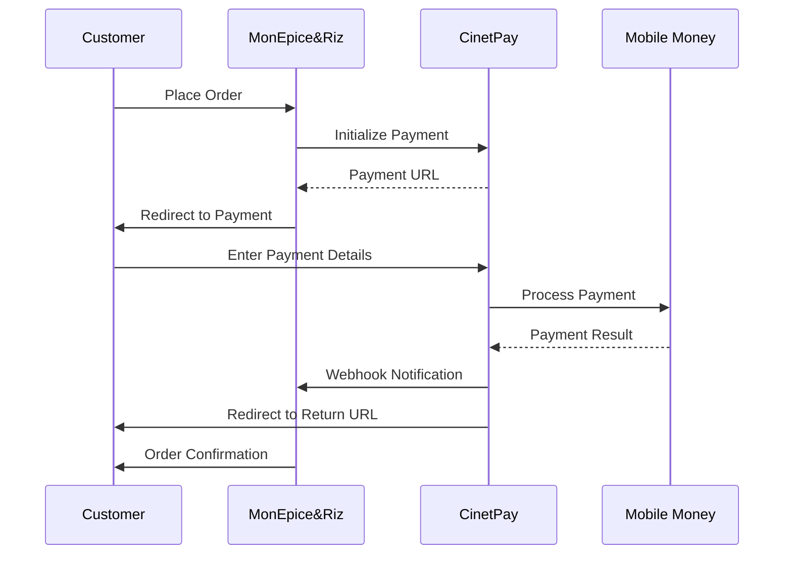

# CinetPay Setup Guide - MonEpice&Riz

This guide provides detailed instructions for setting up CinetPay as the payment gateway for MonEpice&Riz, including account creation, integration configuration, and testing procedures specific to Côte d'Ivoire.

## Overview

CinetPay is the leading payment gateway in West Africa, providing:
- **Mobile Money**: Orange Money, MTN Mobile Money, Moov Money, Wave
- **Bank Cards**: Visa, Mastercard (local and international)
- **Bank Transfers**: Direct bank integration
- **Cash Payments**: Agent network across Côte d'Ivoire

## Prerequisites

- Valid business registration in Côte d'Ivoire
- Bank account with an Ivorian bank
- Tax identification number (NIF)
- Business license and permits
- Identity documents of business owner

## Account Creation

### 1. Sandbox Account (Development)

1. **Visit CinetPay Console**: [console.cinetpay.com](https://console.cinetpay.com)

2. **Create Developer Account**:
   ```
   Account Type: Developer/Sandbox
   Business Name: MonEpice&Riz (TEST)
   Email: dev@monepiceriz.ci
   Phone: +225 XX XX XX XX
   Country: Côte d'Ivoire
   ```

3. **Account Verification**:
   - Verify email address
   - Complete phone verification
   - Accept terms and conditions

4. **Get Sandbox Credentials**:
   ```
   API Key: [sandbox-api-key]
   Site ID: [sandbox-site-id]  
   Secret Key: [sandbox-secret-key]
   ```

### 2. Production Account (Live)

1. **Business Account Application**:
   ```
   Account Type: Business
   Legal Business Name: [Your registered business name]
   Business Type: E-commerce
   Industry: Retail/Grocery
   Registration Number: [RCCM number]
   Tax ID: [NIF number]
   ```

2. **Required Documents**:
   - **Business Registration** (RCCM)
   - **Tax Certificate** (Attestation fiscale)
   - **Bank Account Statement** (last 3 months)
   - **Identity Card** (CNI or Passport)
   - **Business License** if applicable
   - **Proof of Address** for business location

3. **KYC Process**:
   - Document upload and verification
   - Business verification call
   - Bank account verification
   - Processing time: 2-5 business days

4. **Production Credentials** (after approval):
   ```
   API Key: [production-api-key]
   Site ID: [production-site-id]
   Secret Key: [production-secret-key]
   ```

## Integration Configuration

### 1. Environment Variables

Add CinetPay configuration to your environment files:

**.env.local (Development)**
```env
# CinetPay Sandbox Configuration
CINETPAY_API_KEY=your-sandbox-api-key
CINETPAY_SITE_ID=your-sandbox-site-id
CINETPAY_SECRET_KEY=your-sandbox-secret-key

# Webhook URLs
CINETPAY_NOTIFY_URL=http://localhost:3000/api/webhooks/cinetpay
CINETPAY_RETURN_URL=http://localhost:3000/checkout/confirmation
CINETPAY_CANCEL_URL=http://localhost:3000/checkout/payment
```

**.env.production**
```env
# CinetPay Production Configuration
CINETPAY_API_KEY=your-production-api-key
CINETPAY_SITE_ID=your-production-site-id
CINETPAY_SECRET_KEY=your-production-secret-key

# Webhook URLs
CINETPAY_NOTIFY_URL=https://monepiceriz.ci/api/webhooks/cinetpay
CINETPAY_RETURN_URL=https://monepiceriz.ci/checkout/confirmation
CINETPAY_CANCEL_URL=https://monepiceriz.ci/checkout/payment
```

### 2. Webhook Configuration

Configure webhooks in the CinetPay dashboard:

1. **Go to Settings** → **Webhooks** in CinetPay console
2. **Add Webhook Endpoint**:
   ```
   Name: MonEpice&Riz Payment Notifications
   URL: https://monepiceriz.ci/api/webhooks/cinetpay
   Events: All payment events
   Secret: [auto-generated or custom]
   Status: Active
   ```

3. **Test Webhook** (in sandbox):
   ```bash
   # Test webhook endpoint
   curl -X POST http://localhost:3000/api/webhooks/cinetpay \
     -H "Content-Type: application/json" \
     -d '{
       "cpm_trans_id": "TEST_123456",
       "cpm_site_id": "your-site-id",
       "cpm_trans_status": "00",
       "cpm_amount": "5000",
       "cmp_currency": "XOF",
       "signature": "test_signature"
     }'
   ```

### 3. Payment Methods Configuration

Configure available payment methods for Côte d'Ivoire:

#### Mobile Money Operators
```javascript
const MOBILE_MONEY_CONFIG = {
  ORANGE_MONEY: {
    name: 'Orange Money',
    code: 'OM',
    logo: '/images/payment/orange-money.png',
    fees: '1.5% + 50 FCFA',
    limits: { min: 100, max: 500000 }
  },
  MTN_MOBILE_MONEY: {
    name: 'MTN Mobile Money',
    code: 'MOMO', 
    logo: '/images/payment/mtn-momo.png',
    fees: '1.5% + 50 FCFA',
    limits: { min: 100, max: 750000 }
  },
  MOOV_MONEY: {
    name: 'Moov Money',
    code: 'MOOV',
    logo: '/images/payment/moov-money.png', 
    fees: '1.5% + 50 FCFA',
    limits: { min: 100, max: 300000 }
  },
  WAVE: {
    name: 'Wave',
    code: 'WAVE',
    logo: '/images/payment/wave.png',
    fees: '1% (no additional fees)',
    limits: { min: 100, max: 1000000 }
  }
};
```

#### Card Payments
```javascript
const CARD_CONFIG = {
  VISA: {
    name: 'Visa',
    code: 'VISA',
    logo: '/images/payment/visa.png',
    fees: '2.5% + 100 FCFA',
    supported: true
  },
  MASTERCARD: {
    name: 'Mastercard', 
    code: 'MASTERCARD',
    logo: '/images/payment/mastercard.png',
    fees: '2.5% + 100 FCFA',
    supported: true
  }
};
```

## Testing Procedures

### 1. Sandbox Testing

#### Test Mobile Money Payments

Use these test phone numbers for different scenarios:

```javascript
const TEST_NUMBERS = {
  SUCCESS: '+2250143215478',      // Will always succeed
  INSUFFICIENT_FUNDS: '+2250143215479', // Will fail with insufficient funds
  TIMEOUT: '+2250143215480',      // Will timeout
  CANCELLED: '+2250143215481'     // User will cancel
};
```

#### Test Card Payments

Use these test card numbers:

```javascript
const TEST_CARDS = {
  SUCCESS_VISA: '4242424242424242',
  SUCCESS_MASTERCARD: '5555555555554444',
  DECLINED: '4000000000000002',
  INSUFFICIENT_FUNDS: '4000000000009995',
  EXPIRED: '4000000000000069'
};
```

#### Test Transaction Flow

1. **Create Test Payment**:
   ```javascript
   const testPayment = {
     transaction_id: 'TEST_' + Date.now(),
     amount: 2500,
     currency: 'XOF',
     description: 'Test Order - Escargots',
     customer_name: 'Test Customer',
     customer_phone: '+2250143215478',
     customer_email: 'test@monepiceriz.ci'
   };
   ```

2. **Process Payment**: Use sandbox API to process
3. **Verify Webhook**: Check webhook reception
4. **Confirm Status**: Verify payment status update

### 2. Production Testing

#### Pre-Launch Checklist

- [ ] Production credentials configured
- [ ] Webhook URLs updated to production domains
- [ ] SSL certificates valid
- [ ] Rate limiting configured
- [ ] Error handling implemented
- [ ] Transaction logging enabled
- [ ] Customer notification system tested

#### Small Value Testing

Start with small transactions (100-500 FCFA) to test:
- Payment processing flow
- Webhook notifications
- Order confirmation
- Customer notifications
- Refund procedures

## Security Configuration

### 1. Webhook Security

Implement webhook signature verification:

```javascript
// Webhook signature verification
function verifyWebhookSignature(payload, signature, secret) {
  const crypto = require('crypto');
  
  // CinetPay uses SHA256 HMAC
  const expectedSignature = crypto
    .createHmac('sha256', secret)
    .update(JSON.stringify(payload))
    .digest('hex');
    
  return crypto.timingSafeEqual(
    Buffer.from(signature),
    Buffer.from(expectedSignature)
  );
}
```

### 2. API Security

- **IP Whitelisting**: Configure allowed IP addresses
- **Rate Limiting**: Implement request rate limits
- **Encryption**: Use HTTPS for all API calls
- **Key Rotation**: Regular rotation of API keys

### 3. Transaction Security

- **Amount Validation**: Server-side amount verification
- **Duplicate Prevention**: Transaction ID uniqueness
- **Timeout Handling**: Proper timeout management
- **Logging**: Comprehensive transaction logging

## Payment Flow Implementation

### 1. Standard Payment Flow



### 2. Error Handling

Implement proper error handling for:

```javascript
const ERROR_CODES = {
  '01': 'Payment failed - Insufficient funds',
  '02': 'Payment failed - Invalid account',
  '03': 'Payment failed - Transaction cancelled',
  '04': 'Payment failed - Transaction timeout',
  '05': 'Payment failed - Network error',
  '06': 'Payment failed - Invalid PIN',
  '07': 'Payment failed - Account blocked'
};
```

## Compliance & Regulations

### 1. Côte d'Ivoire Regulations

- **BCEAO Compliance**: Follow WAEMU banking regulations
- **Data Protection**: Comply with local data protection laws
- **Tax Obligations**: Proper transaction reporting
- **Consumer Protection**: Clear terms and refund policies

### 2. PCI DSS Compliance

Although CinetPay handles card processing:
- Never store card information
- Use secure transmission (HTTPS)
- Implement proper logging
- Regular security audits

## Monitoring & Analytics

### 1. Transaction Monitoring

Monitor key metrics:
- **Success Rate**: Percentage of successful transactions
- **Payment Methods**: Usage distribution by method
- **Transaction Volume**: Daily/monthly transaction amounts
- **Failed Transactions**: Failure reasons and patterns

### 2. CinetPay Dashboard

Regularly review:
- Transaction reports
- Settlement reports
- Chargeback notifications
- Account health metrics

### 3. Custom Analytics

Implement tracking for:
```javascript
// Payment analytics
const paymentAnalytics = {
  trackPaymentAttempt: (method, amount) => {},
  trackPaymentSuccess: (method, amount, duration) => {},
  trackPaymentFailure: (method, amount, errorCode) => {},
  trackPaymentMethod: (method, userLocation) => {}
};
```

## Support & Troubleshooting

### 1. Common Issues

**Payment Failures**:
- Check customer balance/credit
- Verify phone number format
- Confirm network connectivity
- Review transaction limits

**Webhook Issues**:
- Verify endpoint URL accessibility
- Check signature validation
- Review server logs
- Test webhook manually

**Integration Errors**:
- Validate API credentials
- Check request format
- Review error responses
- Test in sandbox first

### 2. Support Contacts

- **CinetPay Support**: support@cinetpay.com
- **Phone Support**: +225 XX XX XX XX
- **Developer Documentation**: [docs.cinetpay.com](https://docs.cinetpay.com)
- **Status Page**: [status.cinetpay.com](https://status.cinetpay.com)

### 3. Emergency Procedures

**Payment Service Outage**:
1. Enable "Cash on Delivery" mode
2. Notify customers via SMS/email
3. Display service status on website
4. Contact CinetPay support
5. Monitor status page for updates

## Go-Live Checklist

### Pre-Launch
- [ ] Production account approved and active
- [ ] All credentials configured correctly
- [ ] Webhook endpoints tested
- [ ] Payment methods configured
- [ ] Error handling implemented
- [ ] Security measures in place
- [ ] Monitoring systems active

### Launch Day
- [ ] Switch to production environment
- [ ] Monitor first transactions closely
- [ ] Test all payment methods
- [ ] Verify webhook notifications
- [ ] Check customer notifications
- [ ] Monitor dashboard metrics

### Post-Launch
- [ ] Daily transaction reconciliation
- [ ] Weekly performance review
- [ ] Monthly settlement verification
- [ ] Quarterly security review
- [ ] Regular credential rotation

---

**Last Updated**: January 2025  
**Next Review**: Quarterly or when adding new payment methods